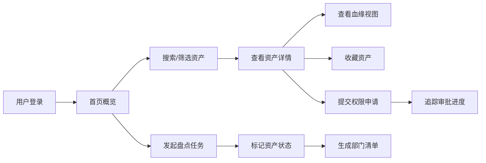

## 1. 产品概述

数据资产地图是面向企业数据管理团队的数据资产管理平台，通过可视化方式全景展示各业务系统的数据资产分布、血缘关系和使用状态，帮助数据管理者快速掌握数据资产全貌，提升数据治理效率。

- 目标用户：数据管理团队、数据分析师、业务系统负责人
- 核心价值：降低数据发现成本、提升数据治理透明度、加速数据资产价值释放

## 2. 核心功能

### 2.1 用户角色

| 角色 | 注册方式 | 核心权限 |
|------|----------|----------|
| 数据管理员 | 企业账号登录 | 全功能访问、资产盘点、权限审批 |
| 数据分析师 | 企业账号登录 | 资产浏览、收藏、权限申请 |
| 业务负责人 | 企业账号登录 | 负责资产查看、盘点确认 |

### 2.2 功能模块

1. **地图首页**：全局数据资产概览、系统分布热力图、核心指标卡片、热门资产推荐、搜索入口
2. **资产目录**：多维度筛选浏览、资产列表展示、标签筛选、收藏功能
3. **资产详情**：资产基本信息、质量状态、敏感等级、字段说明、使用热度、负责人信息
4. **血缘视图**：上下游血缘关系可视化、来源去向追溯、影响范围分析
5. **权限申请**：申请提交、审批进度追踪、历史申请记录
6. **盘点任务**：资产盘点发起、盘点状态标记、部门资产清单生成、废弃/待确认标记

### 2.3 页面详情

| 页面名称 | 模块名称 | 功能描述 |
|----------|----------|----------|
| 地图首页 | 顶部导航 | Logo、全局搜索、用户头像、收藏入口、消息通知 |
| 地图首页 | 指标看板 | 资产总数、系统数量、待盘点数、高敏资产数等核心指标 |
| 地图首页 | 系统分布 | 按业务系统分类的资产分布可视化（环形/柱状图） |
| 地图首页 | 主题域分类 | 按主题域展示资产数量分布 |
| 地图首页 | 热门资产 | 按访问热度排行的资产列表 |
| 地图首页 | 最近更新 | 最近更新的资产动态时间线 |
| 资产目录 | 筛选侧边栏 | 按系统、主题、负责人、质量状态、敏感等级筛选 |
| 资产目录 | 标签筛选区 | 常用标签快速筛选、标签云展示 |
| 资产目录 | 资产列表 | 卡片式/列表式切换展示，含热度、更新时间、质量、敏感等级标识 |
| 资产目录 | 分页排序 | 分页浏览、按名称/热度/更新时间排序 |
| 资产目录 | 搜索栏 | 关键词搜索、搜索历史记录 |
| 资产详情 | 信息概览 | 资产名称、所属系统、主题域、负责人、更新时间 |
| 资产详情 | 状态标签 | 质量状态、敏感等级、热度等级、收藏状态 |
| 资产详情 | 字段信息 | 字段列表、字段描述、数据类型、是否敏感字段 |
| 资产详情 | 元数据 | 数据量、存储大小、创建时间、更新频率 |
| 资产详情 | 操作区 | 收藏按钮、权限申请按钮、查看血缘按钮 |
| 血缘视图 | 血缘图谱 | 可视化节点连线图，展示上下游关系 |
| 血缘视图 | 层级导航 | 上游/下游层级切换、层级深度控制 |
| 血缘视图 | 节点详情 | 点击节点查看资产简要信息和跳转入口 |
| 血缘视图 | 视图控制 | 缩放、拖拽、全屏、布局切换 |
| 权限申请 | 申请表单 | 资产选择、申请原因、使用期限、权限类型 |
| 权限申请 | 审批流程 | 审批节点展示、当前审批人、预计审批时间 |
| 权限申请 | 申请记录 | 历史申请列表、状态筛选、进度查看 |
| 盘点任务 | 任务列表 | 盘点任务概览、状态筛选、进度统计 |
| 盘点任务 | 新建盘点 | 选择部门/系统、设置盘点周期、分配负责人 |
| 盘点任务 | 资产清单 | 按部门生成资产清单、导出功能 |
| 盘点任务 | 状态标记 | 标记确认/废弃/待确认、备注说明 |

## 3. 核心流程

用户登录后，可在首页全局浏览数据资产概况，通过搜索或分类导航找到目标资产，查看详情和血缘关系，常用资产可收藏；需要使用数据时提交权限申请并追踪审批进度；数据管理员可发起资产盘点任务，标记资产状态，按部门生成资产清单。

## 4. 用户界面设计

### 4.1 设计风格

- **主色调**：深海蓝 (#0F172A) 为背景主色，搭配科技青 (#06B6D4) 作为强调色，整体呈现数据科技感
- **辅助色**：翡翠绿 (#10B981) 表示正常/通过，琥珀橙 (#F59E0B) 表示警告/待处理，玫红 (#F43F5E) 表示高风险/高敏感
- **字体**：主字体使用「JetBrains Mono」搭配「Noto Sans SC」，数字和代码使用等宽字体增强科技感
- **布局风格**：左侧导航 + 顶部搜索栏 + 主内容区，卡片式模块化布局，细微网格背景增强数据感
- **视觉元素**：微光渐变边框、玻璃拟态卡片、数据流动线装饰、节点光晕效果
- **动效**：数据指标数字滚动、卡片悬浮微抬升、节点脉冲光效、页面切换淡入滑动

### 4.2 页面设计概述

| 页面名称 | 模块名称 | UI 元素 |
|----------|----------|---------|
| 地图首页 | 指标看板 | 大数字卡片、微光边框、渐变背景、数字滚动动画 |
| 地图首页 | 系统分布 | 环形图、悬浮提示、分类色标 |
| 地图首页 | 热门资产 | 排名序号、热度条、资产卡片、横向滚动 |
| 资产目录 | 筛选侧边栏 | 折叠面板、多选标签、滑块控件、应用筛选按钮 |
| 资产目录 | 资产卡片 | 标题、状态标签组、元数据行、收藏图标、悬浮效果 |
| 资产详情 | 信息概览 | 大标题、状态徽章、负责人头像、关键数据网格 |
| 资产详情 | 字段表格 | 斑马纹行、敏感字段高亮、展开/收起详情 |
| 血缘视图 | 图谱区域 | 节点圆形卡片、贝塞尔曲线连线、发光效果、力导向布局 |
| 权限申请 | 申请表单 | 分步表单、进度条、表单验证提示 |
| 权限申请 | 进度追踪 | 时间线、审批节点、状态色标 |
| 盘点任务 | 任务看板 | 泳道布局、任务卡片、拖拽感、状态角标 |

### 4.3 响应式

- 桌面端优先设计，主内容区最小宽度 1200px
- 平板端自适应缩放，侧边栏可收起
- 移动端简化布局，底部 tab 导航，列表优先展示

### 4.4 数据可视化指导

- **图表库**：使用 ECharts 实现数据可视化
- **血缘图谱**：使用 AntV G6 实现力导向关系图
- **色彩规范**：使用统一的语义化配色，状态色与全局一致
- **交互动效**：图表加载动画、悬浮高亮、渐变色填充
