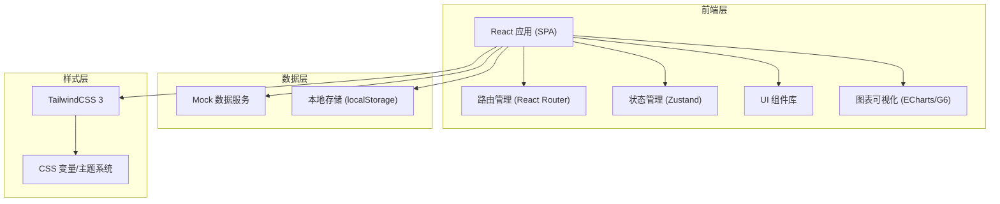
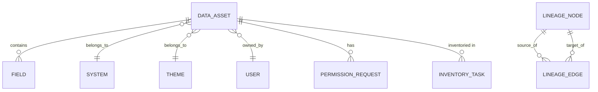

## 1. 架构设计



## 2. 技术描述

- **前端框架**：React@18 + TypeScript + Vite@5
- **路由方案**：React Router v6
- **状态管理**：Zustand（轻量、简洁、支持中间件）
- **UI 样式**：TailwindCSS@3 + CSS 变量主题系统
- **图表库**：ECharts@5（数据图表）、AntV G6@5（血缘关系图）
- **图标库**：Lucide React（轻量、一致性好）
- **构建工具**：Vite@5（快速启动、HMR）
- **代码规范**：ESLint + Prettier
- **后端/数据**：Mock 数据 + localStorage 持久化，纯前端实现

## 3. 路由定义

| 路由路径 | 页面名称 | 描述 |
|----------|----------|------|
| / | 地图首页 | 全局概览、指标看板、热门资产 |
| /catalog | 资产目录 | 多维度筛选、资产列表浏览 |
| /asset/:id | 资产详情 | 资产信息、字段、元数据 |
| /lineage/:id | 血缘视图 | 上下游血缘关系图谱 |
| /permissions | 权限申请 | 权限申请、审批进度 |
| /inventory | 盘点任务 | 盘点任务管理、资产清单 |
| /favorites | 我的收藏 | 收藏的资产列表 |

## 4. 数据模型

### 4.1 核心数据类型

```typescript
// 数据资产
interface DataAsset {
  id: string;
  name: string;
  description: string;
  systemId: string;
  systemName: string;
  themeId: string;
  themeName: string;
  ownerId: string;
  ownerName: string;
  ownerAvatar: string;
  department: string;
  qualityStatus: 'excellent' | 'good' | 'warning' | 'poor';
  sensitivityLevel: 'public' | 'internal' | 'confidential' | 'restricted';
  heatLevel: number; // 1-5
  viewCount: number;
  dataCount: number;
  storageSize: string;
  updateFrequency: 'realtime' | 'hourly' | 'daily' | 'weekly' | 'monthly';
  lastUpdated: string;
  createdAt: string;
  tags: string[];
  isFavorite: boolean;
  inventoryStatus: 'confirmed' | 'pending' | 'deprecated' | 'unverified';
}

// 字段信息
interface Field {
  id: string;
  name: string;
  description: string;
  type: string;
  isSensitive: boolean;
  isNullable: boolean;
  sampleValue: string;
}

// 血缘关系
interface LineageNode {
  id: string;
  name: string;
  type: 'table' | 'view' | 'api' | 'report';
  system: string;
  level: number;
}

interface LineageEdge {
  source: string;
  target: string;
  type: 'input' | 'output' | 'transform';
}

// 权限申请
interface PermissionRequest {
  id: string;
  assetId: string;
  assetName: string;
  applicantId: string;
  applicantName: string;
  reason: string;
  permissionType: 'read' | 'write' | 'admin';
  duration: string;
  status: 'pending' | 'approved' | 'rejected' | 'processing';
  currentApprover: string;
  approvers: string[];
  createdAt: string;
  updatedAt: string;
  approvalHistory: ApprovalRecord[];
}

interface ApprovalRecord {
  approver: string;
  action: 'approve' | 'reject' | 'transfer';
  comment: string;
  time: string;
}

// 盘点任务
interface InventoryTask {
  id: string;
  name: string;
  description: string;
  department: string;
  systemId?: string;
  creatorId: string;
  creatorName: string;
  status: 'draft' | 'in_progress' | 'completed';
  totalAssets: number;
  confirmedAssets: number;
  pendingAssets: number;
  deprecatedAssets: number;
  createdAt: string;
  deadline: string;
  assignees: string[];
}

// 系统
interface System {
  id: string;
  name: string;
  description: string;
  assetCount: number;
  department: string;
}

// 主题域
interface Theme {
  id: string;
  name: string;
  description: string;
  assetCount: number;
}

// 用户
interface User {
  id: string;
  name: string;
  avatar: string;
  department: string;
  role: 'admin' | 'analyst' | 'owner';
}
```

### 4.2 数据模型关系



## 5. 项目目录结构

```
src/
├── assets/              # 静态资源
│   └── styles/          # 全局样式、CSS变量
├── components/          # 通用组件
│   ├── layout/          # 布局组件（Sidebar、Header）
│   ├── ui/              # 基础UI组件（Card、Badge、Button）
│   └── charts/          # 图表组件
├── pages/               # 页面组件
│   ├── Home/            # 首页
│   ├── Catalog/         # 资产目录
│   ├── AssetDetail/     # 资产详情
│   ├── Lineage/         # 血缘视图
│   ├── Permissions/     # 权限申请
│   └── Inventory/       # 盘点任务
├── store/               # 状态管理
│   ├── useAssetStore.ts
│   ├── useUserStore.ts
│   └── useUIPreferenceStore.ts
├── data/                # Mock数据
│   ├── assets.ts
│   ├── systems.ts
│   ├── users.ts
│   └── inventory.ts
├── hooks/               # 自定义Hooks
│   ├── useDebounce.ts
│   └── useLocalStorage.ts
├── utils/               # 工具函数
│   ├── format.ts
│   └── constants.ts
├── types/               # TypeScript类型定义
│   └── index.ts
├── App.tsx
├── main.tsx
└── router.tsx
```

## 6. 核心技术决策

1. **纯前端实现**：由于是原型/演示项目，采用 Mock 数据 + localStorage，无需后端服务
2. **Zustand 状态管理**：相比 Redux 更轻量，API 简洁，适合中小型应用
3. **TailwindCSS 3**：原子化 CSS，配合 CSS 变量实现主题系统，开发效率高
4. **ECharts + G6**：ECharts 用于统计图表，G6 专门用于关系图谱，各自专精
5. **Lucide Icons**：轻量、一致、开源的图标库，与整体风格契合
6. **组件化设计**：按功能模块拆分组件，提高复用性和可维护性
7. **暗色主题优先**：配合数据科技感的设计风格，默认深色主题
